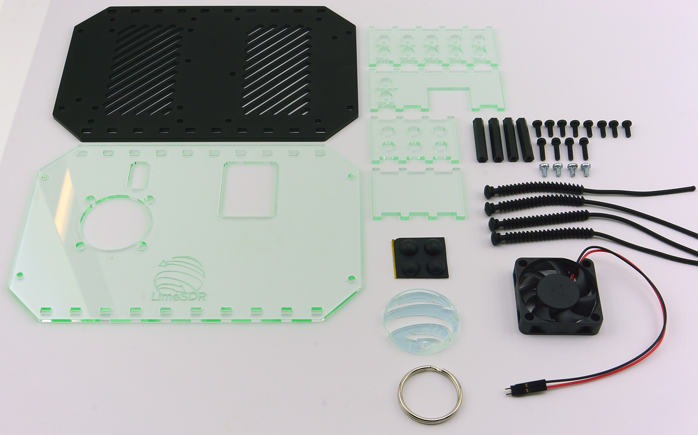
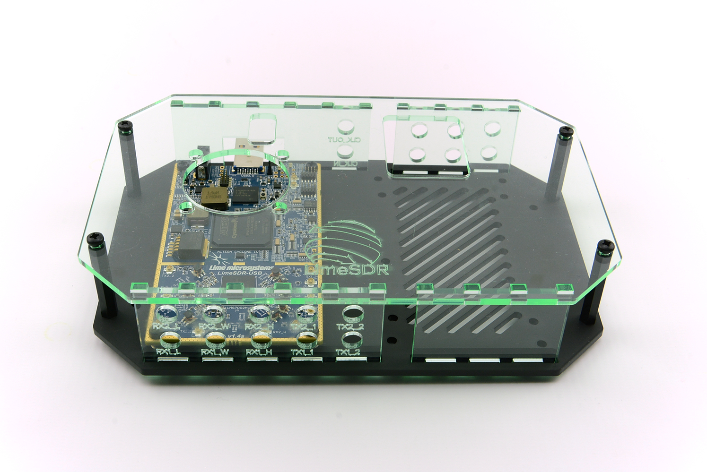

# LimeSDR-USB Hacker Case Assembly Guide

This document outlines the assembly steps to successfully assemble your LimeSDR-USB Hacker Case.

## Steps

1. Check the kit contents - the contents of your kit should match the BOM listed in the repository README

2. Begin by securing 4x 30mm M3 threaded standoffs to the black base piece, using 4x black steel M3 screws

3. Solder the two-pin fan header (included on the end of the fan lead) onto the LimeSDR-USB fan header J14 (located close to the U.FL antenna connections)

4. Fasten the fan to the top piece, using the four rubber barbed mounts

5. Fasten the LimeSDR to the base piece using the four M3x5 screws & standoffs fastened to the LimeSDR PCB (Note: pliers might be helpful to hold the PCB standoffs stationary whilst tightening the screws)

6. Insert the four side panels so that the connectors line up with the LimeSDR connectors - at this point U.FL pigtails should also be fastened to the panels

7. Fasten the top piece to the threaded standoffs using the remaining 4x black steel M3 screws

8. Stick the included 4x rubber bumpers to the bottom of the case

Assembly is now complete!